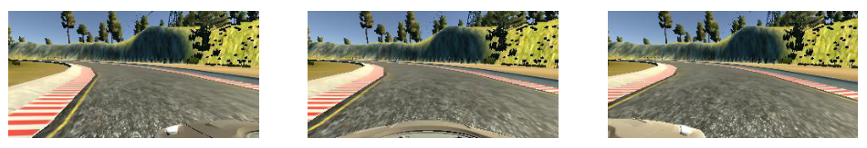
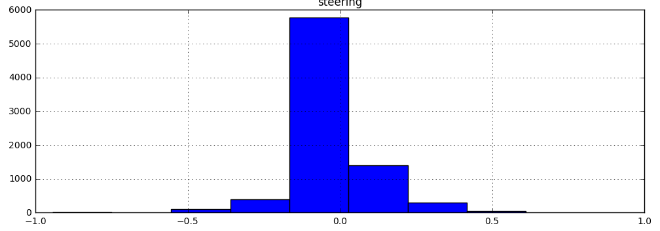
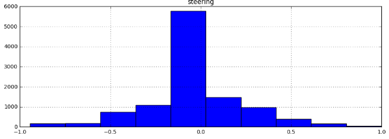
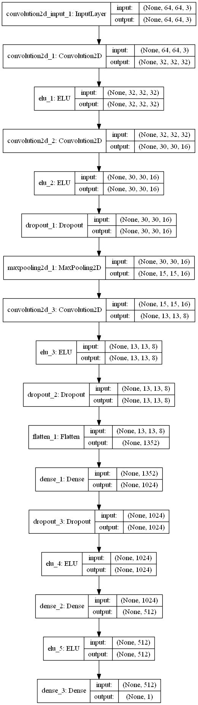
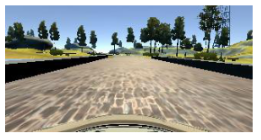
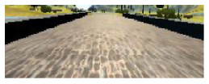
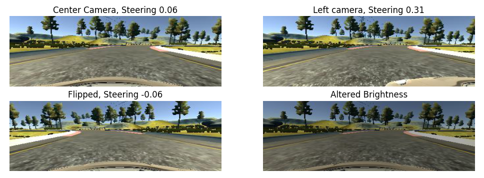
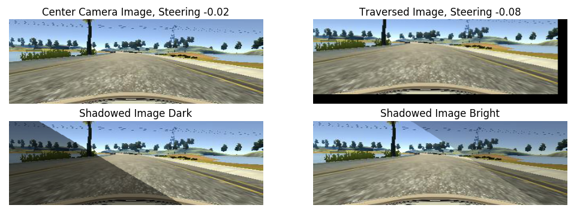

# Introduction
This repository contains the code targeting the *Behavioral Cloning Project of the Udacity Self Driving Car Nanodegree*.
The Behavioral Cloning Project aims to copy the human control of a car in a simulator. It uses a Convolutional Deep Neural Network to train a model based on virtual camera images taken from the simulator's car. It can be seen as a approach to mimik a real conceivable training task of an actual car which in turn would capture real images of the road.

A summary of the task is can be wrapped into three main blocks:
* First, record training data in simulator's training mode by driving the track yourself. The actual recording of images was already built in the simulator. Alternatively it was possible to use training images provided by Udacity. I chose the latter option.
* Second, train a network using the recorded images and a csv file containing the corresponding steering angles per image. The networks layout can be choosen free of choice. It is suggetsable, however, to orientate on the already implemnted networks.
* Third, evaluate the autonomous driving performance in the simulator's autonomous mode. The simulator hereby takes the trained model and it weights to instantenly compute the correct steering angle for each frame.

# Approach
The approach to tackle this project was a mix of reading trough the mentioned NVidia paper, studying helpful Medium blog posts and Slack messages, dive into recommended articels by other SDC-lers and applying a handful of engineering try-and-error. Instead of recording own data, I directly used the data set by Udacity, motivated by blog posts saying it is possible, though it contains way less training data as suggested by others to be a minimum. 

I divided the task into those subtasks:
* Figure out and implement howto use a Generator
* Read in csv and the coressponding images
* Pre-process the images
* Try out and implement augmentation techniques
* Research for a applicable model and implement with keras
* Get the autonomous driving mode to run with the model

Before the final architecture was decided and the model well trained, a working chain was in focus.

## Car Recovery
As noted in the lectures, the model must be trained for recovery as it might occur that the car diverges from the "ideal" center line. This cna be either done by recording exact these recorver actions, or, as suggested by the NVIDIA paper, We can incorporate the left and right camera images to simulate recovery, by adding or subtracting an artificial steering angle to the center steering value according to the direction. This was done and is further described in the augmentation section.

# Data Description
As described in the exploration document [exploration.html](exploration.html), where I did some pre-analysis of the udacity dataset, the data set consists of basically the two inputs:
* driving_log.csv with driving commands and links to images
* images of three virtual cameras, left, center and right.

The *driving_log.csv* contains logs of a training session, each recorded frame per row, structured as follow:

|center|left|right|steering|throttle|brake|speed|
|---|---|---|---|---|---|---|
|IMG/center_...jpg|IMG/left_...jpg|IMG/right_....jpg|0.1765823| 0.9855326|0|30.18422|

The *IMG* folder contains the actual captured images in jpg format, visualized as follow:

For the project I choose to use the already provided data from udacity. Nevertheless I also recorded some data for myself, but this was not included into the training process.

## Distribution
By plotting the distribution of the steering angles, we can observe that most of the time the steering angle is close to zero:
* Stronger steering angles are very rare
* There is a bias towards steering angles which are positive
Hence, the data set is very unbalanced and biased towards small steering angles which can be problematic in strong curves. Also the bias of positive angles can be problematic. In partiular this issue was observable in a latter stage where the model was already quite well trained for the "normal" curves but was struggling with the sharp left after the bridge.

This is the distribution of steering angles before countermeasures:

## Countermeasures
I came up with some coutermeasures, namely:
* Countermeasures for positive steering angle bias: The images can be flipped horizontally (and invert the corresponding steering angle), so that we can reduce the bias for turing left (see section 'Pre-Processing')
* Countermeasure for small steering angle bias: Possible solution is to increase the number of images and steering angles where we detect a high degree of curvature, based on the actual input steering angle. By duplicating those detected images we get a slighty more balanced dataset. Note that by using this technique we are not really generating new data, since we just copying rows from the csv file on the fly. Also, since the augmentation takes place on the fly, it helps overfitting with same images as two augmentations very unlikely equal each other.

This is the distribution of steering angles after "adding" data:

# Model
The model of the network used for training is a sequential keras model with five layers. From the beginning it was quite clear that we need Convolution layers, to be able to exploit the 2D characteristics of the image and to search for reoccuring patterns (like edges).  The activation function shall be non-linear, so I came up with ELUs which were recommended throughout the reviewd documents. Dropout layers reduce overfitting and MaxPooling reduces the size of the outputs. Some more Dense layers after a required Flatten layer gradually reduced the output size to eventually 1 - the actual steering angle value.

1. The first layer is a 2D Convolution with an ELU activation, using the images input shape (kRows = 64, kCols = 64, kChannels = 3) and outputs a shape of 32x32x32. The convolution uses a subsample of (2, 2) to reduce the number of pixels and same padding, which in total reduced the number of pixel dimension by half.

2. In the second layer another Convolution layer is applied, followed by a MaxPooling stride, activated by an ELU. The first Dropout layer with a keep probablity of 40% is introduced to prevent overfitting. The output shape is 15x15x16.

3. A last Convolution layer with again ELU activation, Droput with same 40% keep probability is followed. The Output shape is 13x13x8, since the subsample is (1, 1) with valid padding.

4. A flatten layer transforms the 3 dimensional (4 if you take the actual batches into account) into a flat one.

5. The fourth layer is the first Dense one, reducing the dimension to 1024, using Dropout and likewise an ELU activation.

6. Eventually a Dense layer with ELU activastion closes the main layer-stack reducing the output shape to 512.

7. Since we are not interested into a classification but rather are confornted with a regression problem, we add a simple single dense layer of output shape, which can be understood as the actual value of the output steering angle.

## Model Visualized
The model is summarized and visualized as follow:

# Pre-Processing

First, each image was cropped at the top and bottom, rationale:
* The actual visible road is superimposed by the vehicle's body
* The image contains a lot of sky which is not helpful to train the network

|The raw input image|The cropped image|
|---|---|
|||

## Augmentation
### Use left & right camera images to simulate recovery
Using left and right camera images to simulate the effect of car wandering off to the side, and recovering. We will add a small angle 0.25 to the left camera and subtract a small angle of 0.25 from the right camera. The main idea being the left camera has to move right to get to center, and right camera has to move left.
#### Flip the images horizontally
Since the dataset has a lot more images with the car turning left than right(because there are more left turns in the track), you can flip the image horizontally to simulate turing right and also reverse the corressponding steering angle.
#### Brightness Altering
In this you adjust the brightness of the image to simulate driving in different lighting conditions

Visualization of the augmentation techniques: Multiple cameras, Flipping and Brightness Altering

#### Traversion of images
tbd.
#### Adding Shadows
By adding random shadows we can increase the number of augmented images to as many as we want. The idea behind the shadowing is that the network will be trained to detect the actual important edges of the street and no edges introduced by bad lightning conditons.

Visualization of the augmentation techniques: Traversion and Adding Shadows

# Results
I have taken two video - one per track uploaded on youtube:

* Track 1: https://youtu.be/iqy6XQ0H5s0

* Track 2: https://youtu.be/XvbJq8dvNRY

Note that the recording are in a quite low quality due to adverse influences of the recording program when recoreded in a higher quality (see also 'Other' for details)

During training the mean squared error loss function indeed went down, but was a quite unreliable indicator for the actual success of the simluation. The only valid feedback was the test in the simluator itself.

# Acknowledgment
To document the performance of the trained network on both tracks I atempted to screen-record a video of the Simulator's Autonomous Mode. It was noticed that the actual recording influenced the notebooks performance adversly so that the Simulator struggled to output enough frames per second - or at least much less than without the recording. 
This eventually lead to a worse performance of the autonomous drive since the network was expecting a higher frames per second rate. In detail what happend was that the car was osciliating within the lane, which did not happen without recording. 
I would not blame the recording in particular, but would in general say that the network and the Simulator is not robust for a variation in frames per seconds.

# Credits
Credits shall go in particular to the following blog post, papers and articles:
* The NVIDIA paper suggesting a possible model and a procedure to train an actual car: 
http://images.nvidia.com/content/tegra/automotive/images/2016/solutions/pdf/end-to-end-dl-using-px.pdf
* A good solution which influenced my own implementation: 
https://medium.com/@subodh.malgonde/teaching-a-car-to-mimic-your-driving-behaviour-c1f0ae543686#.r9rvmm3so
* Very helpful introducing applicable augmentation techniques:
https://chatbotslife.com/using-augmentation-to-mimic-human-driving-496b569760a9#.itxajj34m
* Suggestions from a fellow SDCler for basic tricks: 
https://carnd-forums.udacity.com/cq/viewquestion.action?id=26214464&questionTitle=behavioral-cloning-cheatsheet
* A good starting point repository for basic ideas about this project:
https://github.com/commaai/research/blob/master/train_steering_model.py
